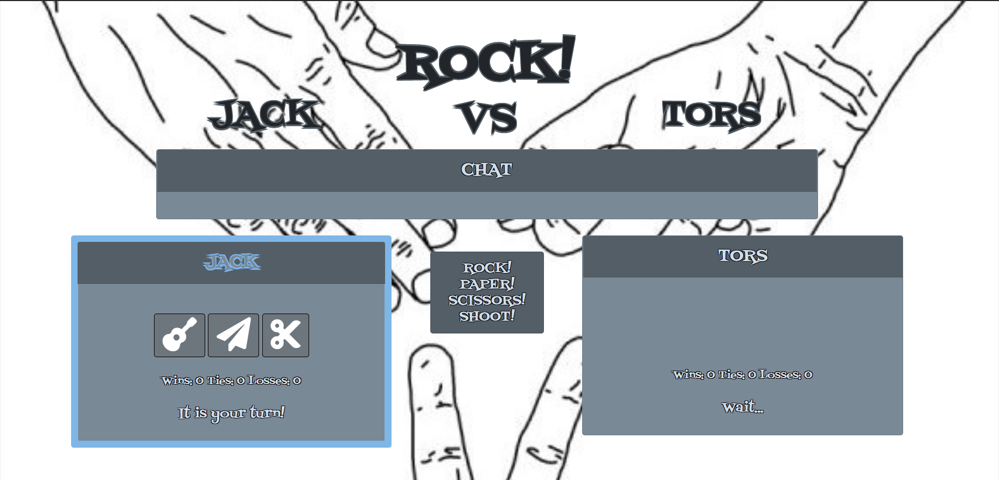

# RPS-Multiplayer

https://kdacanay.github.io/RPS-Multiplayer/

**Rock, Paper, Scissors Multiplayer Game**

* Include JQuery and Firebase 

* Create a game that suits this user story:

      * Only two users can play at the same time.

      * Both players pick either rock, paper or scissors. After the players make their selection, the game will tell them whether tie occurred or if one player defeated the other.

      * The game will track each player's wins and losses.

      * Throw some chat functionality in there! No online multiplayer game is complete without having to endure endless taunts and insults from your jerk opponent.

      * Styling and theme are completely up to you. Get Creative!

      * Deploy your assignment to Github Pages.
      
      
* To design this game, I began by pseudocoding what I thought needed to be included in the game to function properly.  Utilizing firebase, I decided it would be best to have each player their own objects, using JQuery to get the user information.  Each player object would have their name, number of wins, losses and ties, and the choice between rock,paper or scissors.  We will also log each turn, 1 for player 1 and 2 for player 2.  After both turns are taken, then we will have turn 3, where the outcome is determined. Firebase will track everytime a selection is made, each players wins and losses, and then will send back the information to be displayed on the screen for both players to see. 
